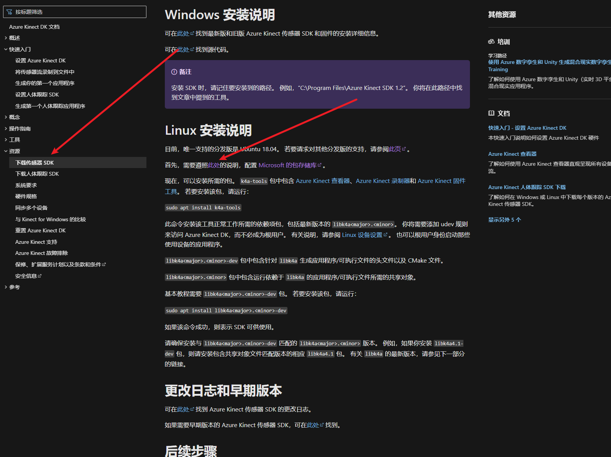

# Azure Kinect DK 深度相机

[TOC]

## 简介ʕ•̀ω•́ʔ✧

[微软官方文档](https://learn.microsoft.com/zh-cn/azure/kinect-dk/)

Azure Kinect DK 是一款开发人员工具包，配有先进的 AI 传感器，提供复杂的计算机视觉和语音模型。 Kinect 将深度传感器、空间麦克风阵列与视频摄像头和方向传感器整合成一体式的小型设备，提供多种模式、选项和软件开发工具包 (SDK)。

## （ ￣ ︶ ￣ ） ↗  安装



**官方安装**

Microsoft 产品的 Linux 软件存储库使用 GPG（GNU 隐私卫士），使用户能够验证文件的真实性并检查下载包的签名。

[GPC公钥下载](https://packages.microsoft.com/keys/microsoft.asc)

下载repo配置包

```
curl -sSL -O https://packages.microsoft.com/config/ubuntu/20.04/packages-microsoft-prod.deb
或
curl -sSL -O https://packages.microsoft.com/config/ubuntu/18.04/packages-microsoft-prod.deb
```

安装repo配置包

```
sudo dpkg -i packages-microsoft-prod.deb
```

更新索引

```
sudo apt-get update
```

安装相机驱动

```
sudo apt install k4a-tools
```

**使用**

```
终端输入
sudo k4aviewer   ----->未添加规则文件需要添加sudo

k4aviewer ------>在设置udev文件之后启动不需要添加 sudo
```

### 设置udev规则

创建 99-k4a.rules  输入以下内容 复制到 '/etc/udev/rules.d/' 中

```
# Bus 002 Device 116: ID 045e:097a Microsoft Corp.  - Generic Superspeed USB Hub
# Bus 001 Device 015: ID 045e:097b Microsoft Corp.  - Generic USB Hub
# Bus 002 Device 118: ID 045e:097c Microsoft Corp.  - Azure Kinect Depth Camera
# Bus 002 Device 117: ID 045e:097d Microsoft Corp.  - Azure Kinect 4K Camera
# Bus 001 Device 016: ID 045e:097e Microsoft Corp.  - Azure Kinect Microphone Array

BUS!="usb", ACTION!="add", SUBSYSTEM!=="usb_device", GOTO="k4a_logic_rules_end"

ATTRS{idVendor}=="045e", ATTRS{idProduct}=="097a", MODE="0666", GROUP="plugdev"
ATTRS{idVendor}=="045e", ATTRS{idProduct}=="097b", MODE="0666", GROUP="plugdev"
ATTRS{idVendor}=="045e", ATTRS{idProduct}=="097c", MODE="0666", GROUP="plugdev"
ATTRS{idVendor}=="045e", ATTRS{idProduct}=="097d", MODE="0666", GROUP="plugdev"
ATTRS{idVendor}=="045e", ATTRS{idProduct}=="097e", MODE="0666", GROUP="plugdev"

LABEL="k4a_logic_rules_end"

```

也可以在以下位置下载 99-k4a.rules

网址：https://github.com/microsoft/Azure-Kinect-Sensor-SDK/tree/develop/scripts

```
将 99-k4a.rules 复制到 '/etc/udev/rules.d/' 中。

sudo cp 99-k4a.rules /etc/udev/rules.d/
```

Azure Kinect 相机无需“root”即可使用。

### 本地安装

下载地址：https://www.lanzouw.com/b00tao6evg	密码:4v5w

下载的时候需要看清楚后缀  

amd64 为x86_64 电脑

arm64 为 jetson主机

```
sudo apt install ./k4a-tools_1.4.1_amd64.deb
sudo apt install ./libk4a1.4-dev_1.4.1_amd64.deb 
sudo apt install ./libk4a1.4_1.4.1_amd64.deb 
```

*在此处使用apt install 而不使用 dpkg，apt install可以自动安装所需的依赖包，而dpkg安装时软件所需要的依赖包关系需要自己解决*

