# OpenCV

[TOC]

## 简介    ʕ •̀ ω •́ ʔ✧

**OpenCV**的全称是Open Source Computer Vision Library，是一个跨平台的计算机视觉库。OpenCV是由英特尔公司发起并参与开发，以BSD许可证授权发行，可以在商业和研究领域中免费使用。

**官方网站**:https://opencv.org/

**OpenCV拓展库**：https://github.com/opencv/opencv_contrib

[Visual Studio Community  |    Visual Studio Code下载地址](https://visualstudio.microsoft.com/zh-hans/free-developer-offers/)

*注：GitHub下载速度慢，使用Gitee进行下载*

## Cmake安装    (๑ ◔ ‿ ◔ ๑)

*cmake官网：https://cmake.org/*

*cmake镜像网站：https://cmake.org/files/*


**提示：Cmake版本不要下载太高，可能会出现问题。尽量安装3.26以下**


*Windows的安装包为：msi 后缀*

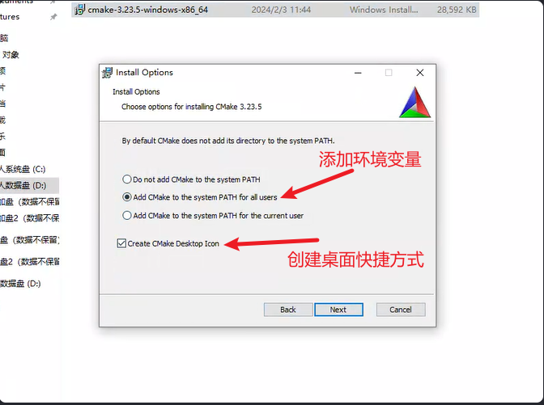


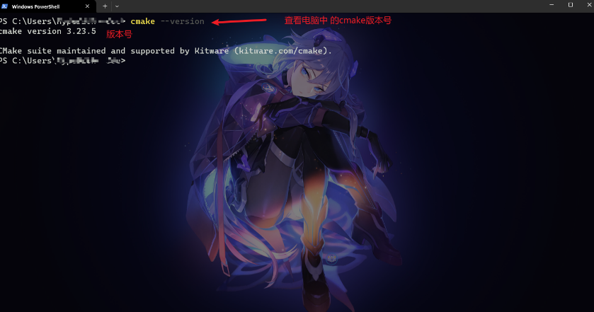

**如果在安装时忘记添加环境变量**


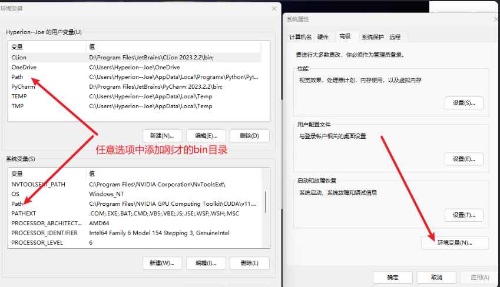

*目录长这样：D:\Program Files\CMake\bin*


## 安装配置OpenCV库   < (￣ ︶ ￣) ↗[GO!]

[OpenCV的GitHub地址](https://github.com/opencv/opencv)

### Windows

#### 官方的预编译库


下载 exe后缀的文件，类似为  opencv-xxx-windows.exe、opencv-xxx-vc14_vc15.exe。这些文件为官方预编译文件可以直接用来使用


使用的路径： xxx\opencv\build\x64     \vc14     或  \vc15

| VS版本             | VC版本 |
| ------------------ | ------ |
| Visual Studio 6    | vc6    |
| Visual Studio 2003 | vc7    |
| Visual Studio 2005 | vc8    |
| Visual Studio 2008 | vc9    |
| Visual Studio 2010 | vc10   |
| Visual Studio 2012 | vc11   |
| Visual Studio 2013 | vc12   |
| Visual Studio 2015 | vc14   |
| Visual Studio 2017 | vc15   |

1. 将    xxx\opencv\opencv\build\x64\vc15\bin    目录添加到环境变量中

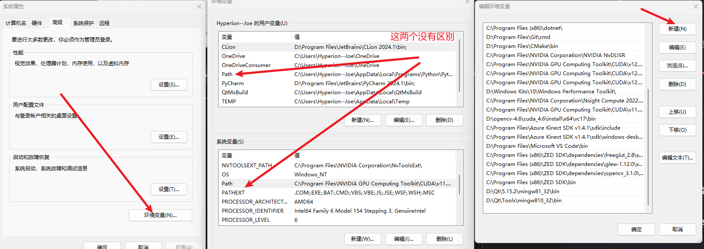

添加到系统环境变量和用户环境变量没有区别，当系统中存在多个用户时可以为用户设置自己的环境。

当Windows系统中存在多个用户时可以单独为用户添加环境变量。

**在Visual Studio中设置**

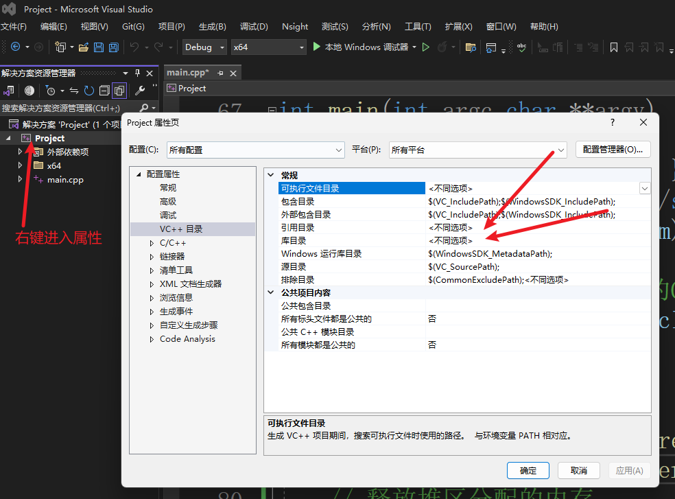

- 在引用目录中添加   include文件夹       xxx\opencv\build\include\opencv2      

- 在库目录中添加       lib文件夹 下的对应的库   xxx\opencv\build\x64\vc15\lib    （这个地方添加的是一个具体的文件，而不是文件夹）

*添加的目标文件取决于自己的项目构建类型*

opencv_worldxxx.lib    Release版本 

opencv_worldxxxd.lib     Debug版本

```
//头文件
#include <opencv2/opencv.hpp>
#include <iostream>
int main() {
    // 打开默认摄像头（通常是0）
    cv::VideoCapture cap(0);
    // 检查摄像头是否打开成功
    if (!cap.isOpened()) {
        std::cerr << "Error: Could not open camera." << std::endl;
        return -1;
    }
    // 创建一个窗口来显示视频  窗口的大小为自动
    cv::namedWindow("Camera", cv::WINDOW_AUTOSIZE);
	//图像的数据类型
    cv::Mat frame;
    while (true) {
        // 从摄像头捕获一帧
        cap >> frame;

        // 检查是否成功捕获
        if (frame.empty()) {
            std::cerr << "Error: Could not capture frame." << std::endl;
            break;
        }

        // 显示捕获的帧
        cv::imshow("Camera", frame);

        // 检查用户是否按下了'q'键来退出
        if (cv::waitKey(1) >= 0 && cv::waitKey(1) == 'q') {
            break;
        }
    }

    // 释放摄像头资源
    cap.release();
    // 销毁所有窗口
    cv::destroyAllWindows();

    return 0;
}

```

(＾－＾) V

#### 手动编译安装

**注：OpenCV可以编译为32位、64位。但CUDA只支持64位。在编译带CUDA版本的OpenCV时必须选择64位**

**注：编译拓展库模块之后OpenCV库全为Release模式，在使用时配置项目设置为Release模式**

Windows可以使用MinGW、Visual Studio进行编译。在使用时必须配置为相同的编译器进行使用。

在手动编译时可以添加OpenCV拓展库，拓展库中存在一些新的模块，新模块通常没有稳定的 API，并且没有经过充分测试。模块成熟并获得普及时，它将被移至中央 OpenCV 存储库。

添加拓展库中主要使用的功能为CUDA加速，但是在实际使用时可以添加其他的库来进行使用。所以拓展模块不是必须。

如果需要添加CUDA版本，需要使用visual studio进行编译，使用MinGW无法编译带cuda版本的opencv。   在编译之前需要先安装显卡驱动和CUDA库。

**源码下载（自行选择版本）**

1. Release下

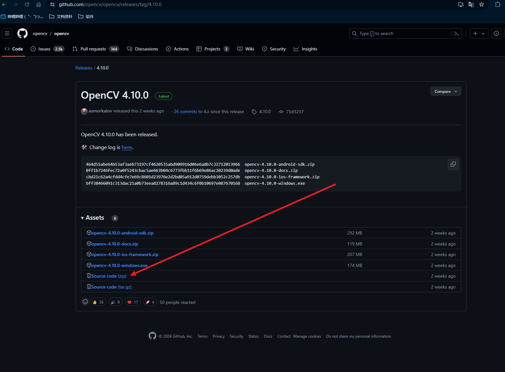

2. 

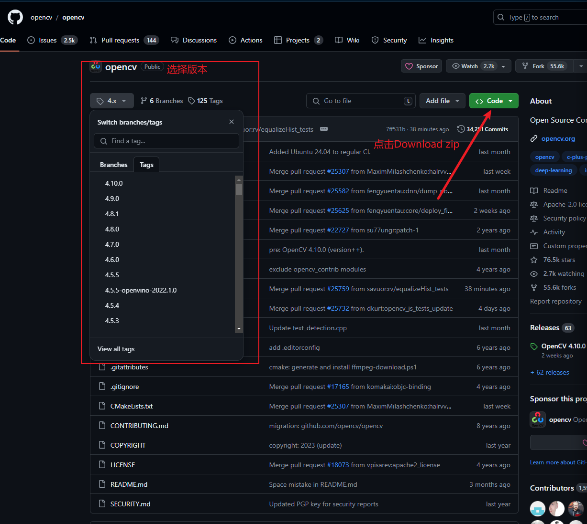


使用MinGW、Visual Studio以及在Linux下进行编译时的选项都一样  只是在开始的时候选择编译器时选择相应的编译器，

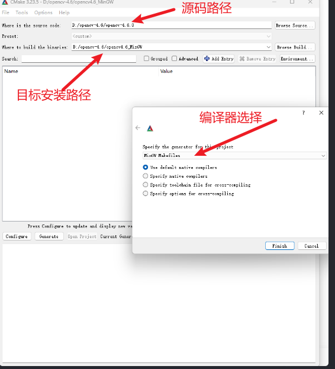

选项：

-BUILD_opencv_world         **不勾选**

*将所有的文件编译成一个包     可能会出现错误，生成多个包后面可以自己配置*

-OPENCV_GENERATE_SETUPVARS      不勾选

*用于生成一个名为opencv_setupvars.sh的脚本文件。这个脚本文件包含了设置OpenCV库环境变量的命令，可以方便地用于在终端中设置OpenCV库的环境变量。        在编译时会产生warning     环境可以自己进行配置*

-OPENCV_ENABLE_NONFREE          勾选

*开启一些有版权的算法的支持*

-ENABLE_FAST_MATH      (自行选择)

*用于启用或禁用快速数学优化。当该选项启用时，OpenCV会使用快速数学优化指令（如SSE、AVX等）来加速数学计算，从而提高程序的性能。但是需要注意的是，快速数学优化可能会引入一些精度损失，因此在一些对精度要求较高的应用场景下可能需要谨慎使用。*

-搜索  test        全部取消勾选

*测试文件  不需要编译*

-BUILD_opencv_python3        取消勾选

-BUILD_opencv_python_bindings_generator     取消勾选

*与python相关的库      在python下可以直接使用指令来下载对应的python*

-BUILD_JAVA       取消勾选

-BUILD_opencv_java_bindings_generator    取消勾选

*与JAVA相关的库      同上*

-BUILD-opencv_js     取消勾选

-BUILD_opencv_js_bindings_generator     取消勾选

*与JavaScript相关的库*

可选项-BUILD_opencv_highgui

*OpenCV的高级图形用户界面模块。在使用imshow时显示图像像素的位置，以及其他的工具*

------

**添加拓展模块**

-OPENCV_EXTRA_MODULES_PATH      填写拓展库的路径  下的modules

*拓展库的路径*

-BUILD_opencv_xfeatures2d        取消勾选（如果可以下载也可以不取消）

-BUILD_opencv_wechat_qrcode       必须取消勾选

-BUILD_opencv_face       取消勾选（可以下载的话可以不取消)

-BUILD_SHARED_LIBS     指定是否要构建共享库（动态链接库）

**CUDA加速**

*注：在编译CUDA加速时需要配置两次*

搜索“cuda”，

勾选 BUILD_CUDA_STUBS、OPENCV_DNN_CUDA、WITH_CUDA

**第一次点击Configure**

勾选 CUDA_FAST_MATH

-------------

当BUILD_SHARED_LIBS被设置为ON时，OpenCV将会被编译成为动态库 dll（Windows下）、so（Linux下）

当BUILD_SHARED_LIBS被设置为OFF时OpenCV将会被编译成为静态库 lib(msvc)、a(MinGW)

*点击Configure之后查看输出栏是否存在 红色 错误 。如果无错误则点击Generate*

- 当编译器为MinGW时

```
打开  配置时选择的文件夹   使用终端打开

-j21 设置为cpu核数   21为自己的电脑cpu核数  根据自己的设备配置
mingw32-make    -j21 
#进行编译
```

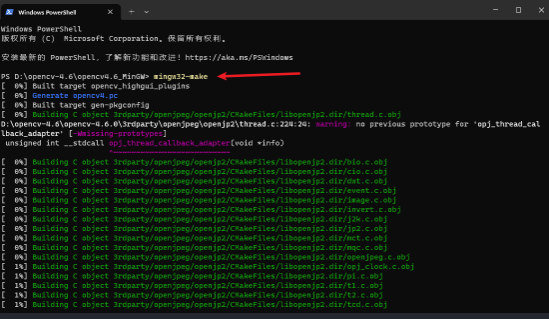

```
安装

mingw32-make install 
```

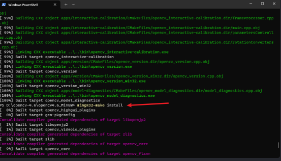

```
配置时指定的路径 D:\opencv-4.6\opencv4.6_MinGW  

最终安装好的文件   在install下
```

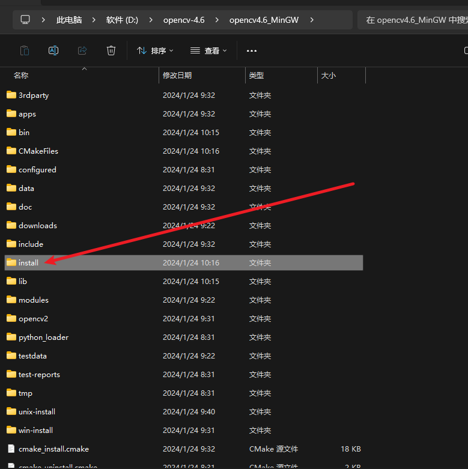

- 当编译器为Visual Studio

打开指定的路径下的       OpenCV.sln

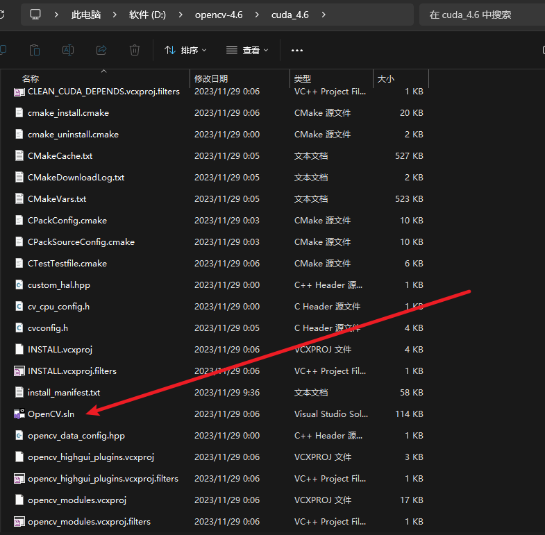


！！！ 如果添加了拓展模块    必须设置为     Release

 *以下都在CMake Targets 中*

1. 选择 All_BUILD    右键生成     等待完成      
2. 选择 INSTALL       右键生成

**最终生成在目录下      install     内**

#### Ubuntu下安装

*可以使用cmake-qt-gui进行配置，也可以使用cmake参数进行配置*

需要的工具

```
sudo apt-get install -y gcc g++ cmake make cmake-qt-gui
```

 依赖库

```
sudo apt-get install -y build-essential libgtk2.0-dev libgtk-3-dev libavcodec-dev libavformat-dev libjpeg-dev libswscale-dev libtiff5-dev libeigen3-dev

sudo apt-get install -y libjpeg-dev libpng-dev  libtiff-dev  libavcodec-dev libavformat-dev  libswscale-dev libv4l-dev  libxvidcore-dev  libx264-dev  libgtk-3-dev  libatlas-base-dev  gfortran libgflags-dev libgoogle-glog-dev
```

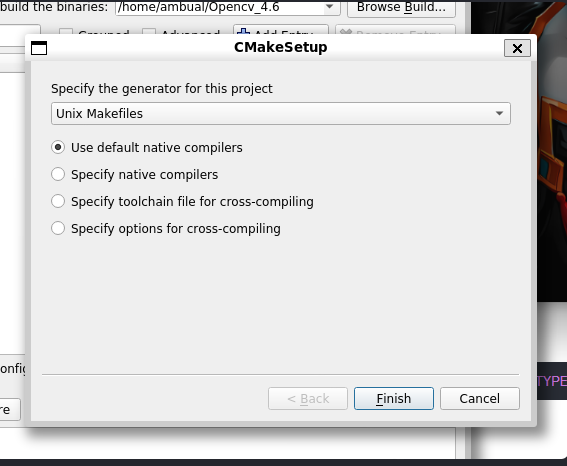

配置目录      编译器选择默认

*需要添加参数*

-OPENCV_GENERATE_PKGCONFIG   

*生成一个pkg-config的路径使得pkgconfig能够自动传递库路径给g++进行编译*

*如果需要配置CUDA，需要先在系统中安装NVIDIA驱动以及CUDA库*

**其他配置同上**

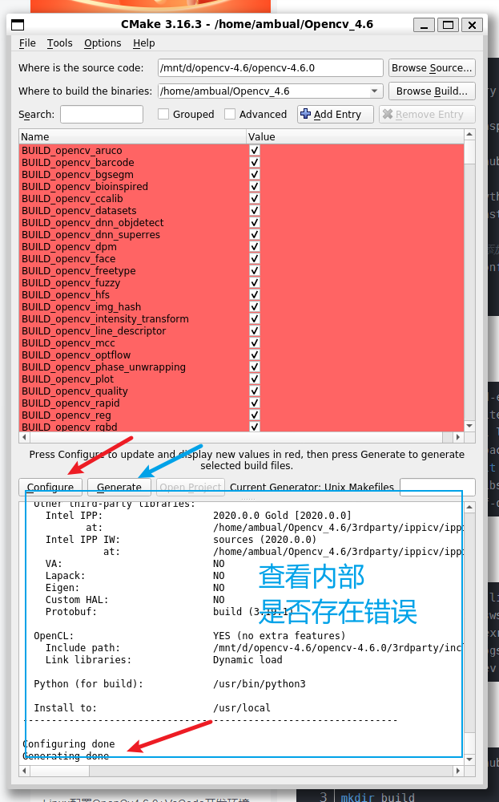

1. 配置完成  点击Configure      等待完成
2. Configure 完成之后查看消息框中是否存在错误，无错误之后点击Generate

```
最终输出为
Configuring done
Generating done
```

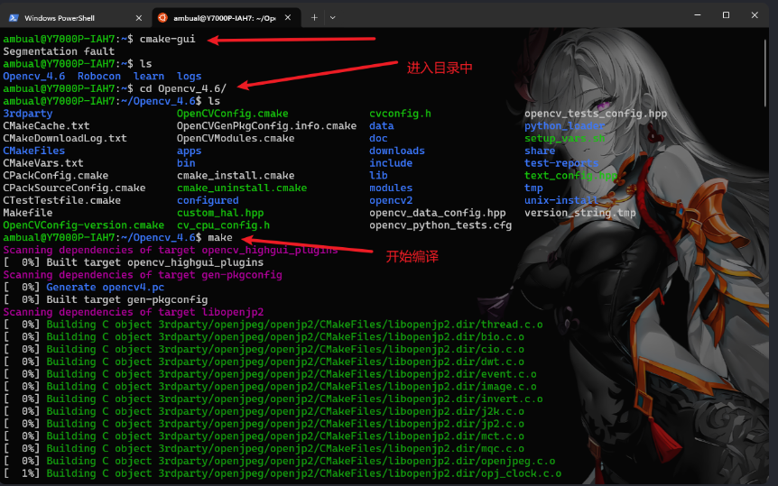

打开设置的文件夹     终端中打开

```
开始编译
-j21 设置为cpu核数   21为自己的电脑cpu核数  根据自己的设备配置

make -j21
```

安装

```
sudo make install
```

配置pkg-config环境

```
opencv4.pc文件路径：/usr/local/lib/pkgconfig/opencv4.pc

======
使用  sudo find / -iname opencv4.pc    查找

```

```
将路径加入到PKG_CONFIG_PATH（用vim或gedit打开）：
sudo vim /etc/profile.d/pkgconfig.sh    
或
sudo gedit /etc/profile.d/pkgconfig.sh
添加：
export PKG_CONFIG_PATH=/usr/local/lib/pkgconfig:$PKG_CONFIG_PATH
```

```
=======================
# 激活
source /etc/profile
========================
验证：
pkg-config --libs opencv4
========================
```

配置动态库环境

```
sudo vim /etc/ld.so.conf.d/opencv4.conf

或

sudo gedit /etc/ld.so.conf.d/opencv4.conf
添加：

/usr/local/lib


===================
使路径生效：
sudo ldconfig

```

**使用参数进行配置**

*说明：使用参数配置，其实就是直接在终端中配置opencv，参数其实就是在桌面版cmake中看见的参数，在每一个参数钱加 -D，选项中勾选为NO，取消勾选为OFF。*

```
===
下面给的参数为添加了拓展库和CUDA加速的版本。可以根据自己的需求自行添加或者修改参数
===

 cmake \
 -D OPENCV_GENERATE_PKGCONFIG=ON \
 -D BUILD_CUDA_STUBS=ON \
 -D OPENCV_DNN_CUDA=ON \
 -D WITH_CUDA=ON \
 -D OPENCV_ENABLE_NONFREE=ON \
 -D BUILD_PERF_TESTS=OFF \
 -D BUILD_TESTS=OFF \
 -D BUILD_opencv_python_tests=OFF \
 -D INSTALL_TESTS=OFF \
 -D OPENCV_EXTRA_MODULES_PATH=拓展库的路径 \
-D CUDA_FAST_MATH=ON \
-D BUILD_opencv_python3=OFF \
-D BUILD_opencv_python_bindings_generator=OFF \
-D BUILD_JAVA=OFF \
-D BUILD_opencv_java_bindings_generator=OFF \
-D BUILD_opencv_js=OFF \
-D BUILD_opencv_js_bindings_generator=OFF \
-D BUILD_opencv_xfeatures2d=OFF \
-D BUILD_opencv_wechat_qrcode=OFF \
-D BUILD_opencv_face=OFF \
/home/titr/opencv(安装的路径)


等待完成之后进行安装的路径

编译--》安装--》配置pkg-config环境--》配置动态库环境
```

---------

**测试**

新建文件夹

```
mkdir test
进入
cd test
```

编写CMakeLists.txt文件

```
vim CMakeLists.txt    
或
gedit CMakeLists.txt  
===================
cmake_minimum_required(VERSION 3.10)

# 项目名称
project(test)

# 设置C++标准
set(CMAKE_CXX_STANDARD 11)
set(CMAKE_CXX_STANDARD_REQUIRED True)

# 查找OpenCV包
find_package(OpenCV REQUIRED)

# 添加可执行文件
add_executable(test main.cpp)

# 链接OpenCV库
target_link_libraries(test ${OpenCV_LIBS})

===================

保存+退出 

```

main.cpp

```
vim main.cpp
或
gedit main.cpp
================
//头文件
#include <opencv2/opencv.hpp>
#include <iostream>
int main() {
    // 打开默认摄像头（通常是0）
    cv::VideoCapture cap(0);
    // 检查摄像头是否打开成功
    if (!cap.isOpened()) {
        std::cerr << "Error: Could not open camera." << std::endl;
        return -1;
    }
    // 创建一个窗口来显示视频  窗口的大小为自动
    cv::namedWindow("Camera", cv::WINDOW_AUTOSIZE);
	//图像的数据类型
    cv::Mat frame;
    while (true) {
        // 从摄像头捕获一帧
        cap >> frame;

        // 检查是否成功捕获
        if (frame.empty()) {
            std::cerr << "Error: Could not capture frame." << std::endl;
            break;
        }

        // 显示捕获的帧
        cv::imshow("Camera", frame);

        // 检查用户是否按下了'q'键来退出
        if (cv::waitKey(1) >= 0 && cv::waitKey(1) == 'q') {
            break;
        }
    }

    // 释放摄像头资源
    cap.release();
    // 销毁所有窗口
    cv::destroyAllWindows();

    return 0;
}

```

进入项目目录

```
创建 build 目录   并进入

mkdir build

cd  build
=====================

构建项目

cmake ..

======================

编译项目
make         可以添加cpu核数     make -j21

======================

运行
./test
```

( o゜▽゜) o☆[ B I N G O ! ]
