# 关于Linux

[TOC]


## 简介  ʕ•̀ω•́ʔ✧

### 1.1 发展历史    ─=≡Σ ( ( ( つ•̀ω•́)つ

​	Unix是一种古老的操作系统（上世纪七十年代）。在Unix之前，操作系统基本都只能进行批处理作 业，相当于你给计算机一批任务，然后计算机逐项去自动执行，执行完了反馈给你结果，在此过程中是不 具可交互性的。为了满足交互性、及时性和多用户同时访问的需要，人们希望研制分时操作系统——通过 时间片轮转为很多用户同时提供交互式服务。早期的尝试能支持的用户量很有限（MIT推动的MAC计划只 能让30名左右的使用者同时共享IBM的大型计算机，到了1965年还最终不堪负荷），于是MIT决定研制更 大型的分时计算机系统——MULTICS——其中通用电子公司参与了硬件开发，贝尔实验室承包了软件也就 是操作系统。但是这一由众多大名鼎鼎的机构联合执行的计划最终失败了，MULTICS被传为笑柄。 

​	但是，当时在贝尔实验室参与分时操作系统开发的成员在此项目中获得了宝贵的经验。贝尔实验室虽 然退出了MULTICS项目，但为创建交互式计算环境的努力从未停止，后来汤姆森(Ken Thompson) 与里奇 (Dennis Ritchie)在一些机缘巧合之下开发了Uniplexed Information and Computing System，被简称 Unix。历经很多版本的改进（其中重大的改进如将内核从由汇编语言写改成由高级语言写，他们尝试过世 界上第一个被正式推广使用的高级语言Fortran，后来又产生出了B语言，但是都不理想，最后改良了B语 言，开发出了C语言，因而里奇被称作C语言之父。这一改进大大增强了Unix的多平台可移植性），人们发 现Unix相比于批处理系统有很多优势，应用规模逐渐扩大，最终贝尔实验室的所有者AT&T公司宣布要将 Unix商业化。由于众多衍生版的出现， 在随后的几十年中，Unix的发展经常伴随着产权纠纷。 目前它的商 标权由国际开放标准组织所拥有。

​	 20世纪80年代，随着硬件计算能力的提升，计算机市场不断扩大。可供选用的操作系统中，Unix是商 业软件，AT&T制定的价格昂贵；DOS系统是单用户单任务的，且源代码被微软当作商业秘密； MacOS系 统只能用于苹果电脑。这在教学上为老师提了难题，因为找不到开源的例子。一名教授就编写了一个操作 系统Minix来讲解操作系统内部工作原理。虽然Minix比较简单，但好处是完全开源的。 

​	全世界学计算机的学生都通过钻研Minix的源代码来学习操作系统，芬兰赫尔辛基大学大学二年级的学 生Linus Torvalds就是其中一个。借鉴了Minix和Unix的思想，Linus在1991年写出了Linux操作系统。他把 Linux的源码放到网上，所有人都可以免费获取，甚至可以进行商业应用。这就使得Linux迅速得到了全世 界计算机企业和爱好者的支持，出现了很多发行版，用户可以根据自己的需要自由增添、剪裁Linux系统。 这样以来，一个庞大的社区来不断更新和维护使Linux具有了长久的生命力。

### 1.2  Linux的主要特点	ლ (╹◡╹ლ )

​	（1）Linux是开源的，遵循GNU通用公共许可证（GPL）。这意味着任何人都可以基于Linux底层代码 创建一个符合自己需求的Linux 发行版。 

​	（2）多用户、多任务。同Unix一样，Linux是分时操作系统，各个用户可以同时登陆，由操作系统来 保证各用户对于各类文件有合适的权限。Linux系统可以同时连接多个终端并且每隔一段时间重新扫描进 程，重新分配进程的优先级，动态分配系统资源，从而在多进程同时运行时保持良好性能。 

​	（3）可操作性。Linux具有很强的可操作性，它将所有操作权都交给了用户，向用户暴露所有的细 节。普通用户刚入手时可能对这些操作有些摸不着头脑，可能一个指令就把操作系统弄崩溃了。但对于开 发者而言，Linux的开放使我们能清楚地看到程序是如何运行的，运行报错也会有友好的提示，根据报错指 引往往能将问题解决。 

​	（4）安全稳定高效。Linux用户权限分级严谨，不容易受到病毒和恶意软件的侵害，在长时间运行下 稳定性和可靠性都非常高。 

​	（5）多平台支持：Linux可以安装在各种硬件平台上。

----------------

**接下来的大部分时间我们使用的都是Ubuntu20.04.6**

现在Ubuntu的版本已经发展出来     Ubuntu 24.04      Ubuntu22.04.4     但是相关的学习资料较少  所以选择Ubuntu20.04.6  ，     如果有兴趣可以自行下载安装

 *环境搭建步骤基本相同，新的版本可能添加一些额外的东西和配置，遇到问题时花费的时间较多*

## 安装Ubuntu	( ◕‿‿◕ )

[Ubuntu官方镜像下载地址](https://releases.ubuntu.com/20.04.6/?_gl=1*1259d2a*_gcl_au*MjY0MjA3MTMyLjE3MTc4NTc5ODg.&_ga=2.152060217.1621733908.1718359050-1814032919.1718359050)

*如果官方网站无法进入或下载速度过慢–可以使用镜像网站进行下载或者只用bt种子方式进行下载*

```
清华大学开源软件镜像站
	- https://mirrors.tuna.tsinghua.edu.cn/ubuntu-releases/20.04.6/
	
中科大源：
	- https://mirrors.ustc.edu.cn/ubuntu-releases/20.04/

```


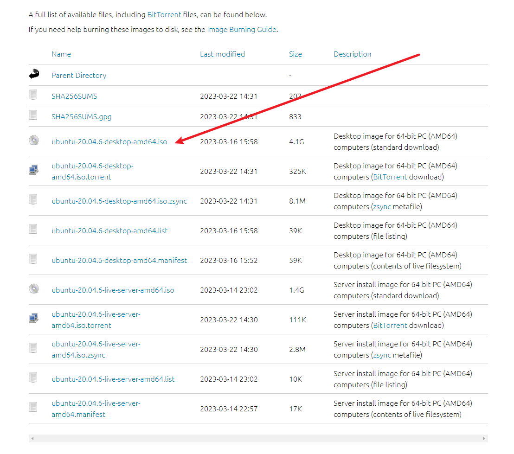

### （ ￣ ︶ ￣ ） ↗	系统U盘制作

- 工具：U盘      镜像
- 软件：ventoy

[ventoy官方下载地址](https://www.ventoy.net/cn/download.html)

```
尽量到以下网站进行下载

- https://github.com/ventoy/Ventoy/releases

- https://gitee.com/longpanda/Ventoy/releases/

- https://mirrors.nju.edu.cn/github-release/ventoy/Ventoy（南京大学镜像站）

- https://mirrors.sdu.edu.cn/github-release/ventoy_Ventoy（山东大学镜像站）

- https://www.lanzoui.com/b01bd54gb（蓝奏云）

- https://www.123pan.com/s/rjSKVv-8YtN 
	提取码: vtoy （123云盘）

- https://pan.baidu.com/s/1UzHMzn6SToxHRYw7HR16_w 
	提取码: vtoy （百度网盘）
```

软件打开       **Ventoy2Disk.exe**

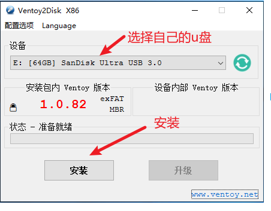

等待进度条走完    U盘的名称变为  **Ventoy** ，将ISO镜像复制到U盘内即可。U盘中可以同时放入多个ISO镜像用于安装多个不同的系统，还可以安装PE系统进行使用。自行搜索操作。

**镜像安装：**

直接把 ISO 镜像拖进 u盘内即可      ( ￣△￣ ；)

**当我们使用制作好的u盘进行启动时：**

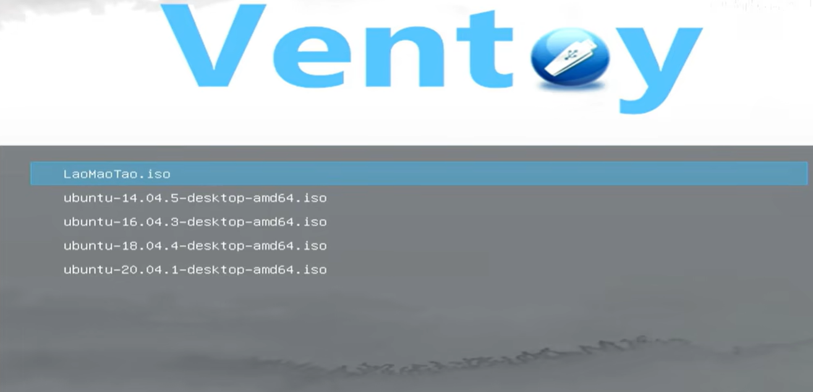

### （ ￣ ︶ ￣ ）↗     安装步骤     

**在安装系统之前先在Windows下磁盘管理为Linux系统新建分区**

选择自己想安装的磁盘，右键 压缩卷。设置大小。

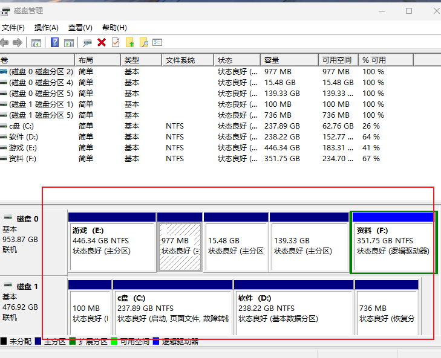

1. 进入Bios设置为U盘启动

   **本人使用   拯救者Y7000P      按   F8   进入Bios**
   
   有的电脑提示 安全模式下无法使用U盘启动。需要在Bios中关闭安全启动

| 主板品牌     | 启动按键 | 笔记本品牌      | 启动按键       | 台式机品牌     | 启动按键 |
| ------------ | -------- | --------------- | -------------- | -------------- | -------- |
| 华硕主板     | F8       | 联想笔记本      | F12            | 联想台式机     | F12      |
| 技嘉主板     | F12      | 宏基笔记本      | F12            | 惠普台式机     | F12      |
| 微星主板     | F11      | 华硕笔记本      | ESC            | 宏基台式机     | F12      |
| 映泰主板     | F9       | 惠普笔记本      | F9             | 戴尔台式机     | ESC      |
| 梅捷主板     | ESC或F12 | 联想Thinkpad    | F12            | 神舟台式机     | F12      |
| 七彩虹主板   | ESC或F11 | 戴尔笔记本      | F12            | 华硕台式机     | F8       |
| 华擎主板     | F11      | 神舟笔记本      | F12            | 方正台式机     | F12      |
| 斯巴达卡主板 | ESC      | 东芝笔记本      | F12            | 清华同方台式机 | F12      |
| 昂达主板     | F11      | 三星笔记本      | F12            | 海尔台式机     | F12      |
| 双敏主板     | ESC      | IBM笔记本       | F12            | 明基台式机     | F8       |
| 翔升主板     | F10      | 富士通笔记本    | F12            |                |          |
| 精英主板     | ESC或F11 | 海尔笔记本      | F12            |                |          |
| 冠盟主板     | F11或F12 | 方正笔记本      | F12            |                |          |
| 富士康主板   | ESC或F12 | 清华同方笔记本  | F12            |                |          |
| 顶星主板     | F11或F12 | 微星笔记本      | F11            |                |          |
| 铭瑄主板     | ESC      | 明基笔记本      | F9             |                |          |
| 盈通主板     | F8       | 技嘉笔记本      | F12            |                |          |
| 捷波主板     | ESC      | Gateway笔记本   | F12            |                |          |
| Intel主板    | F12      | eMachines笔记本 | F12            |                |          |
| 杰微主板     | ESC或F8  | 索尼笔记本      | ESC            |                |          |
| 致铭主板     | F12      | 苹果笔记本      | 长按“option”键 |                |          |
| 磐英主板     | ESC      |                 |                |                |          |
| 磐正主板     | ESC      |                 |                |                |          |
|              |          |                 |                |                |          |

2. 启动之后出现引导界面      选择 –>  Ubuntu

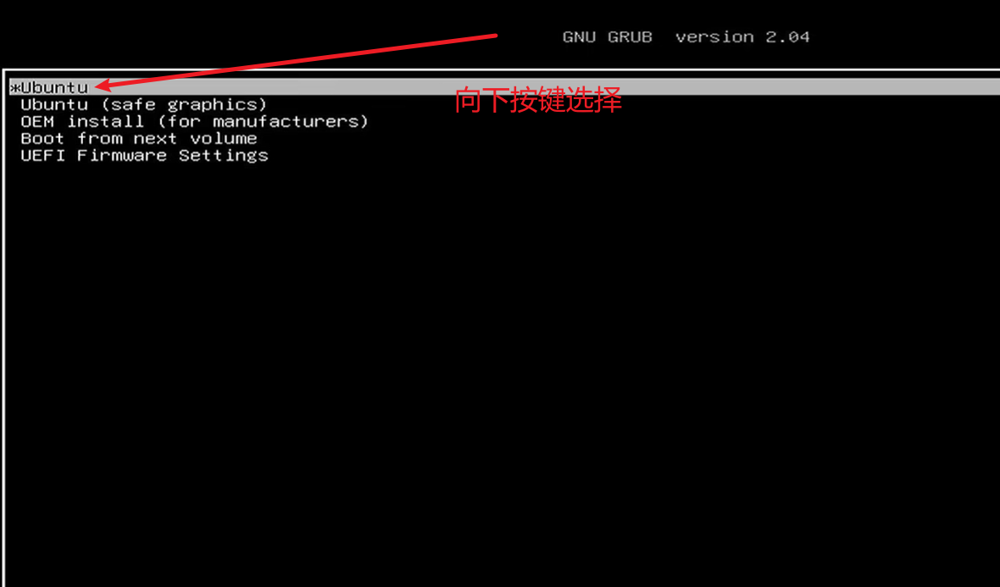

*使用方向键选择，按Enter进入*

进入之后ubuntu会进入文件自检状态，按	Ctrl+C       可以取消自检

3. 选择安装Ubuntu     中文

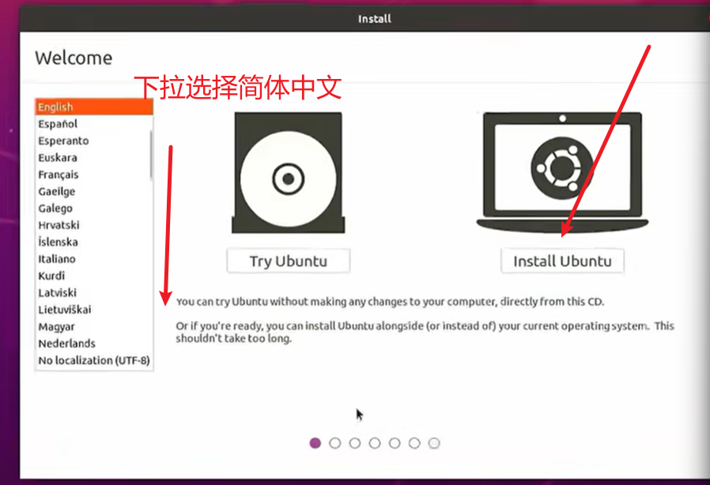

4. 键盘布局       默认

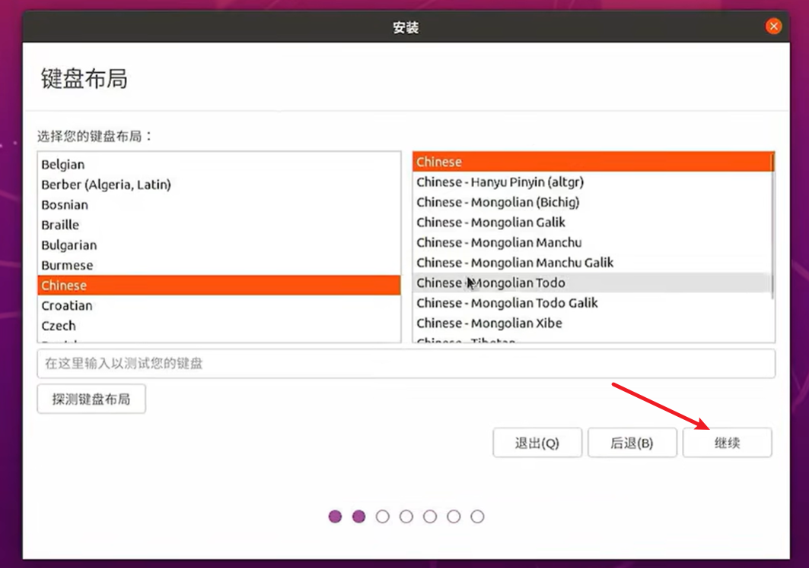

5. 连接网络      暂时不用连接   选择    —> 我现在不想连接Wi-fi无线网络

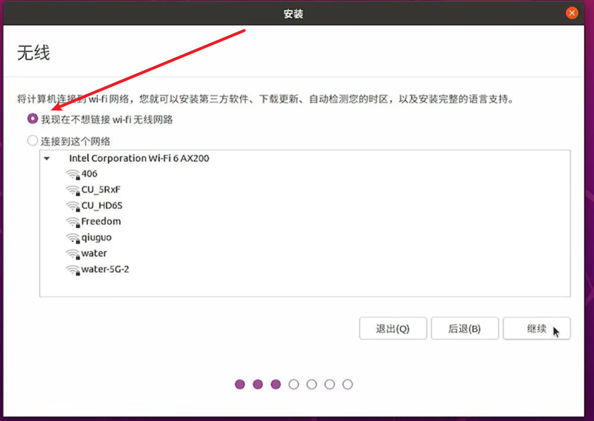

6. 选择最小安装      其他选项全部取消     缩短安装时间

*最小安装将只安装一些默认的软件，其他选项可以进行勾选，勾选之后安装的过程中将自动安装所需的显卡驱动，并且自动进行更新。但是会延长安装时间。在后续过程中可以全部自己进行安装和更新。*

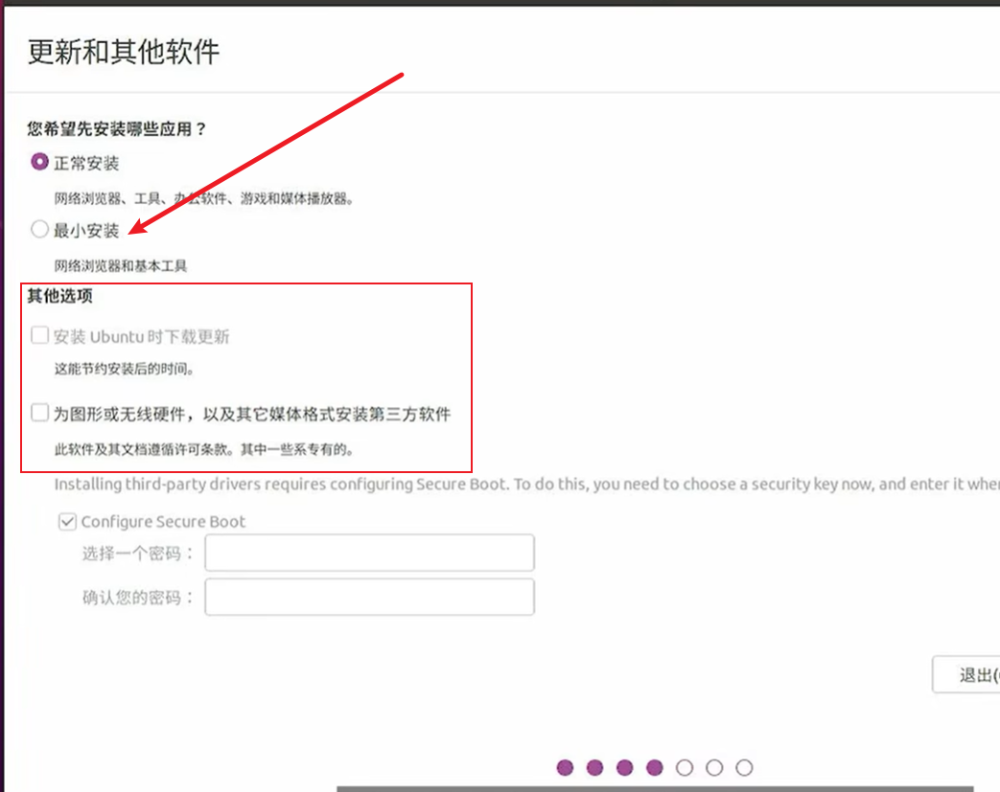

7. 安装类型选择     ——>其他选项

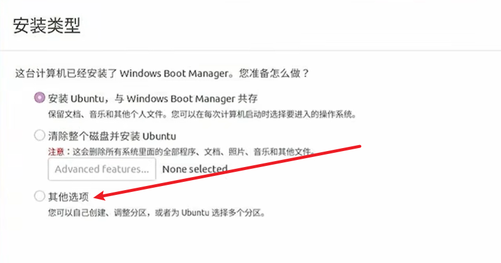

在我们刚开始新建的分区下，为Linux创建相应的分区

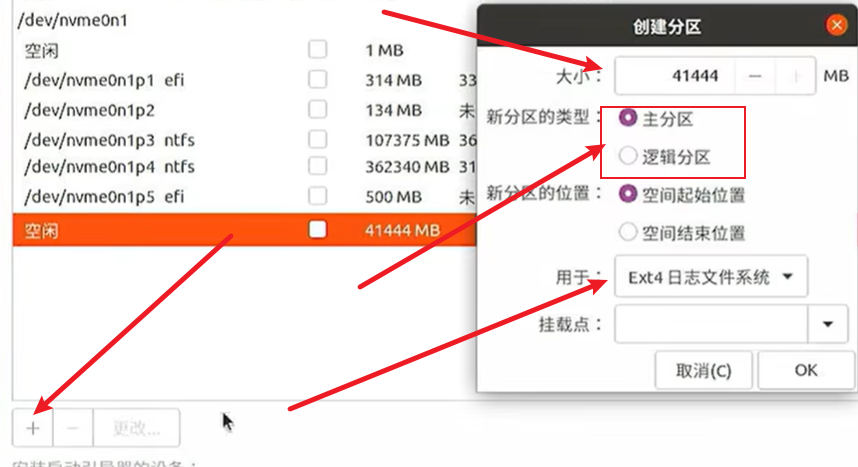

| 分区  | 分区类型 |           用途           |
| ----- | :------: | :----------------------: |
| swap  |  主分区  | 内存—主机的内存大小相同  |
| /     | 逻辑分区 |    主分区    root用户    |
| /boot | 逻辑分区 |     启动目录 200M-2G     |
| /home | 逻辑分区 | 创建的用户存放东西的地方 |

8. 您在什么地方？  ——>    在图上选择中国地区    显示全部为Shanghai

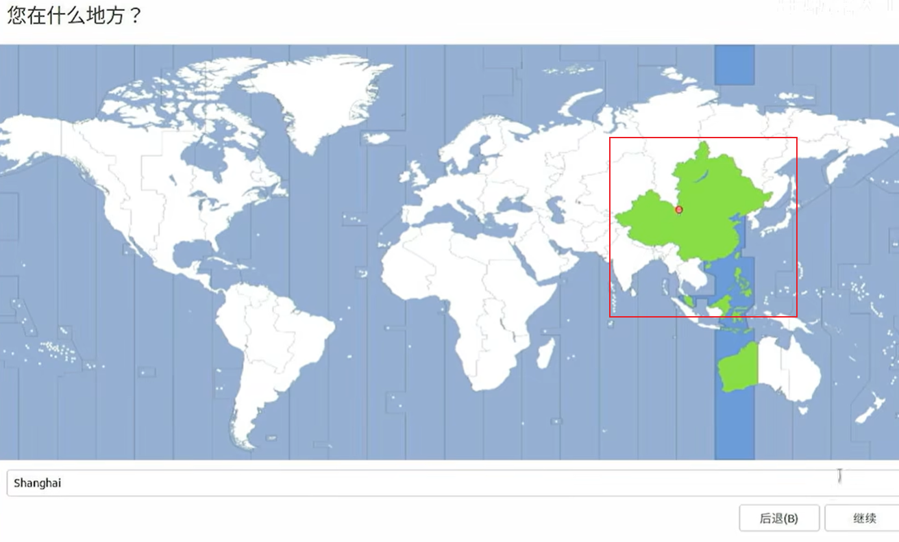

8. 设置用户     用户名、密码

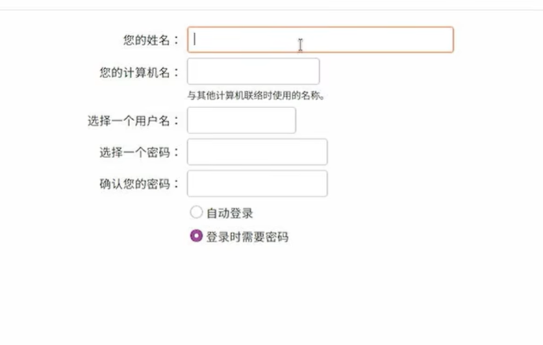

9. 安装
10. 启动

在安装双系统之后每次开机之间都会  进入 GRUB选择界面

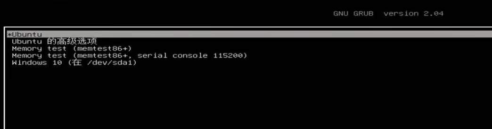

默认选择为ubuntu，如果在开机时没有使用方向键选择，倒计时结束会自动进入ubuntu系统。

需要进入Windows系统，通过方向键选择到     Windows

**注意事项**

- 一些电脑在安装Ubuntu时出现黑屏现象

  在Bios中设置为 独显模式、集显模式


-------------


## Ubuntu设置

**Ctrl+Alt+T**打开终端

**Ctrl+Shift+C**在终端中复制

**Ctrl+Shift+v**在终端中复制

在刚安装好Ubuntu时，Ubuntu内部的软件包源地址为Ubuntu官方地址，下载速度很慢，可以先切换镜像源。

校园网联合镜像源：https://mirrors.cernet.edu.cn/

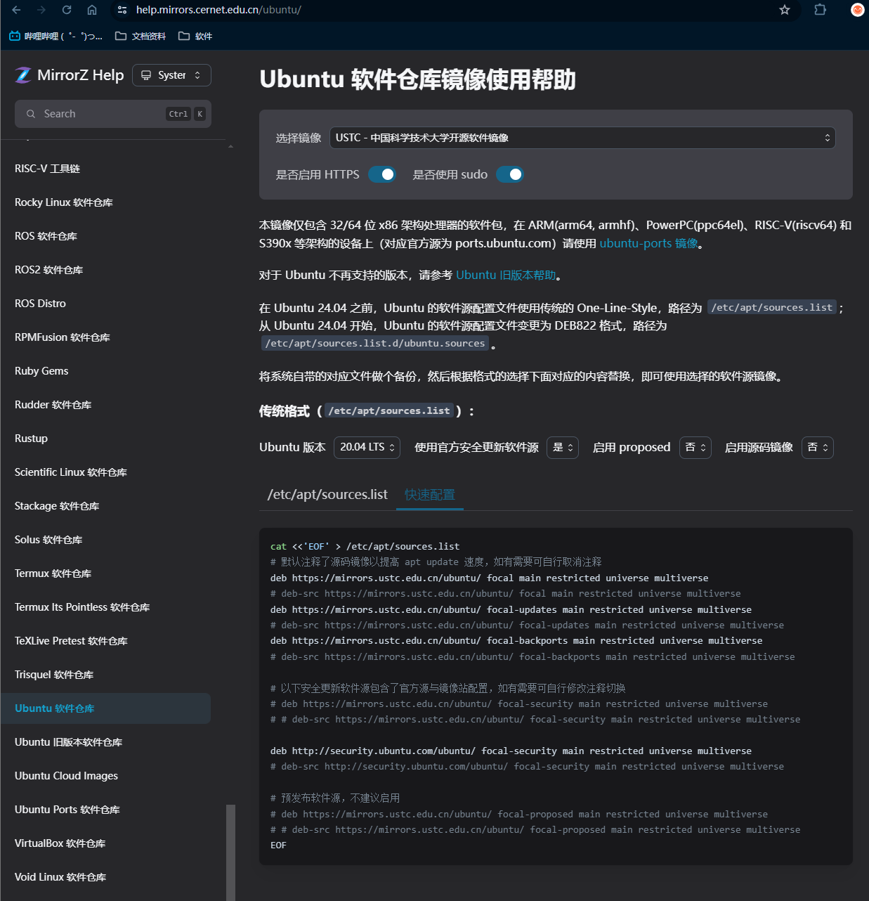

**/etc/apt/sources.list**下是，Ubuntu 的软件源配置文件，可以直接使用vim或gedit打开该文件进行修改（需要使用sudo）。也可以使用提供的指令直接复制到终端

```
进行软件更新

-》更新本地软件包索引
sudo apt update 

-》升级已安装的软件包到最新版本
sudo apt upgrade

===================

在每次切换软件源之后都必须   使用 sudo apt update  更新一次软件列表
```


以上步骤可以直接在桌面下使用软件直接进行修改，可以更快一点


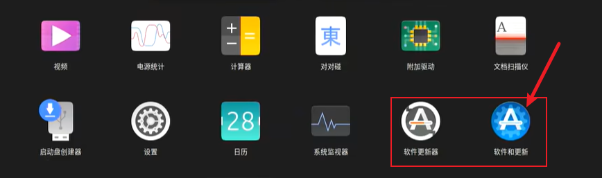

在软件和更新中切换软件源

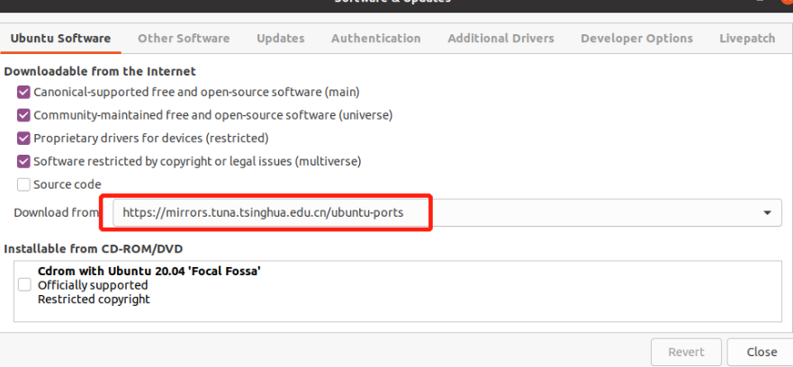

在软件更新器下更新软件包。等待进度条跑完，点击“立即安装”

*软件更新器不需要经常更新，它可能每隔几天自动弹窗几次提示更新，其中邮软件级的，也有系统级的。如果没有什么大问题就不要更新。需要更新软件：直接在终端中使用apt在线安装，或者在官网中下载Deb包进行本地安装*

## 注意事项

- 软件本地安装

在Ubuntu中本地安装包   为deb包 。    后缀为  .deb

Deb包有两种安装方式 dpkg、apt

`dpkg` 是 Debian 软件包管理器的底层工具。它可以直接处理 `.deb` 文件，执行安装、卸载、查询和其他与软件包管理相关的操作。`dpkg` 是一个较低级别的工具，不处理依赖关系。

`apt` 是高级包管理工具,`apt` 会自动处理依赖关系，并从软件源（repository）下载和安装缺失的依赖包。

**dpkg安装**

```
sudo dpkg -i package.deb

- 不处理依赖关系: 如果安装的软件包有未满足的依赖，dpkg 不会自动下载和安装这些依赖，会导致“依赖性错误”。需要手动解决依赖。

====================
如果遇到依赖问题使用

sudo apt-get install -f

尝试修复系统中的依赖问题，安装所有缺失的依赖包。
=====================

如果还存在其他问题，在终端中会给出提示信息，有时还会给出相关的指令。按照提示进行搜索解决
```

**apt安装**

在Ubuntu中使用apt可以直接从软件源中下载相应的软件

```
sudo apt install 软件名

有些软件的软件名可能会多写一些字母。 使用 Tab 可以进行补全

------------------------------
sudo apt install -y 软件名
 
 添加 -y 参数可以直接确认下载
 
 当使用 sudo apt install 软件名  下载软件时 终端中会提示 输入 y确认下载。
 
```

可以使用apt来下载 deb包，`apt` 会自动处理依赖关系，并下载和安装缺失的依赖包。

```
sudo apt install ./下载的deb包包名.deb
```

