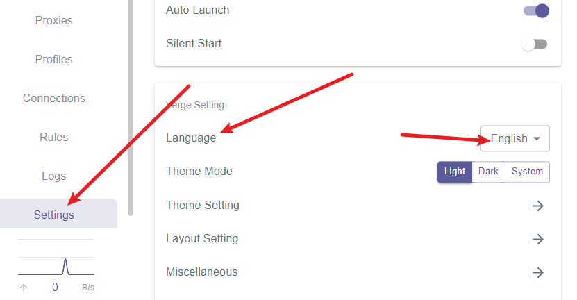
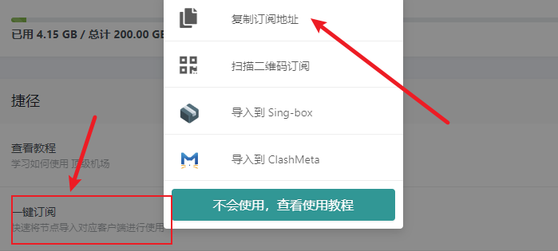
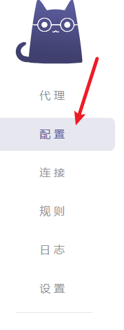
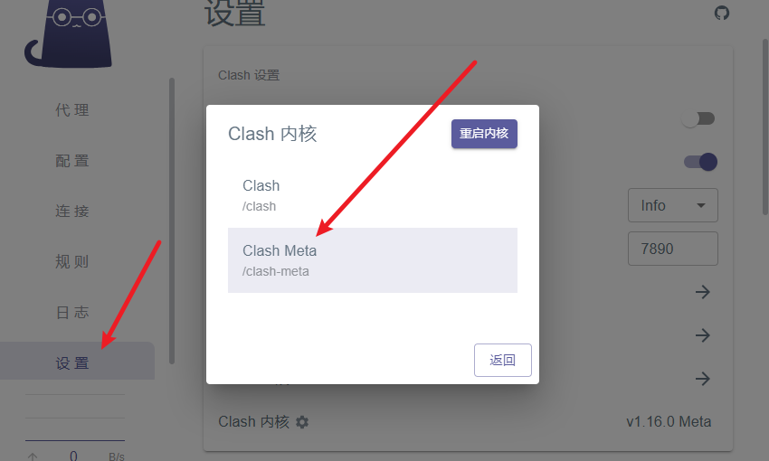
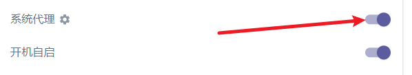

### Clash使用教程

**懂得都懂，不懂的稍微懂懂。我们可以通过它来实现创建    虚拟专用网络**

在使用cmake下载东西、进入github、下载CUDA和CUDNN、pip下载、懒的换源等时需要使用。其他用法自行摸索。

-------

*注：上传的安装包有的是新版，可能长的不一样，用法一致*

下载地址：

https://www.lanzouw.com/b00taojk0j
密码:60rw

压缩密码全都是：123

### 使用方法

*clash内核已经被更新过了，原版的软件可能无法使用一些网站中的东西。这个软件有两个内核，可以直接切换为新版内核，全部兼容。*

**注：刚开始可能为英文，设置中更改为中文**

1. 打开软件
2. 打开下方神秘链接
3. 每个链接中都有 

4. 进行配置

*检查设置中的端口设置：是否为7890 。如果不是，将软件关闭之后（包括后台）重新打开*

## 神秘链接

-点击》          [最萌的云](http://www.cutecloud.top/auth/register?code=NgzCw8)

*有多种共享账号，较贵*

-点击》          [一分](https://xn--4gqx1hgtfdmt.com/#/register?code=J6VjnMKm)

-点击》          [顶级](https://xn--mes358a9urctx.com/#/register?code=QRFBY2vS)

-点击》         [sfcioud](https://www.sofastcloud.com/#/register?code=O7NXkhuM)

*较稳，稍贵*

**免费**

-点击》         [ikuuu](https://ikuuu.pw/auth/login)

*不太稳定，可以用来下载一些东西*